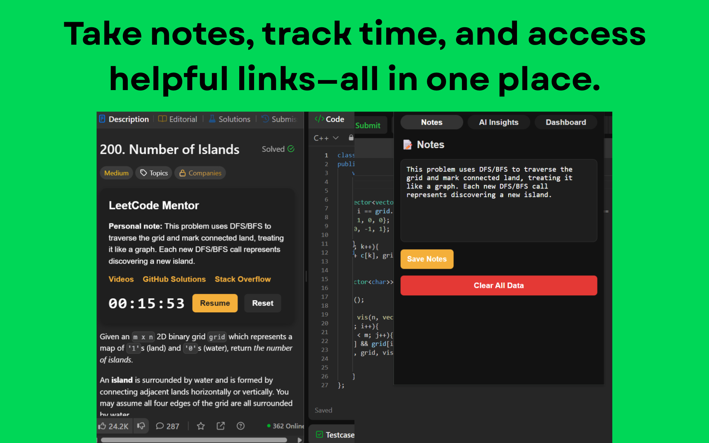
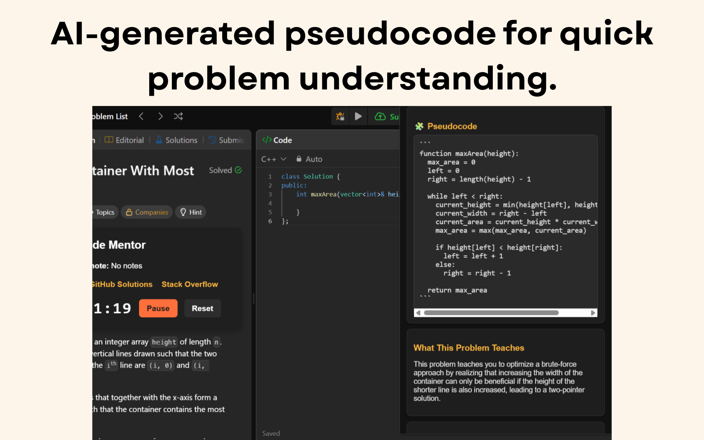
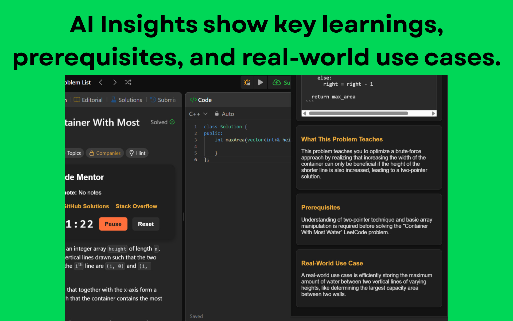
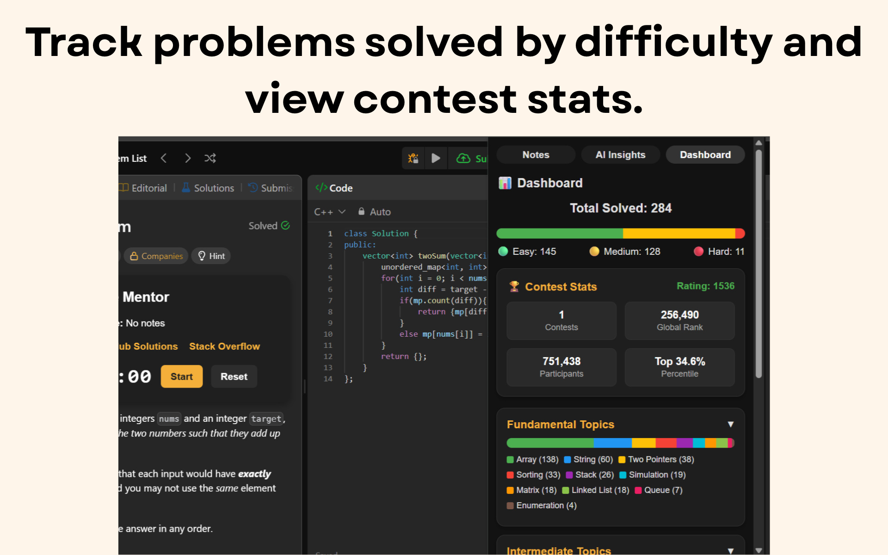
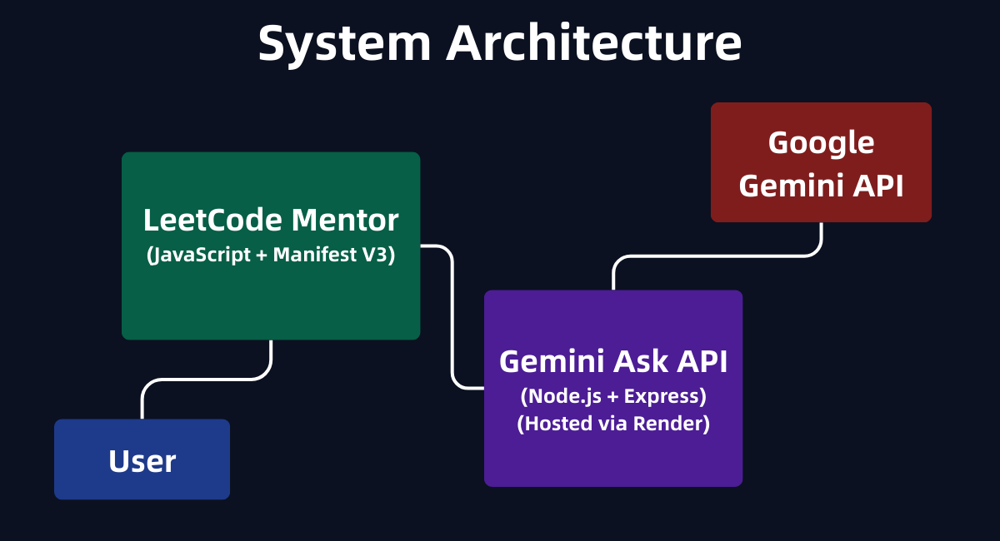

# LeetCode Mentor Chrome Extension

A powerful AI-enhanced Chrome extension that helps you understand, track, and learn LeetCode problems smarter — with personalized notes and Gemini-powered insights.

---


[](https://chromewebstore.google.com/detail/leetcode-mentor/naodegdjgghbeppfefdjfpnpjindgfje)


---

## 🌐 Published At

Chrome Web Store → [view on Web Store](https://chromewebstore.google.com/detail/leetcode-mentor/naodegdjgghbeppfefdjfpnpjindgfje)

---


## ✨ Features
- 📝 Add custom notes for each LeetCode problem directly on the problem page  
- 💾 Automatically saves notes in `localStorage` for instant retrieval  
- 🤖 AI-powered insights using Gemini-ask-api to:  
  - Understand problem importance  
  - Suggest prerequisites  
  - Explain concepts in simple terms  
  - Real-world applications of the problem  
- 🔄 Smart cache system to minimize redundant API calls  
- ✉️ Clean & intuitive UI native to LeetCode look and feel  

---

## 💻 Tech Stack

- [**JavaScript**](https://developer.mozilla.org/en-US/docs/Web/JavaScript) – Core frontend logic and Chrome extension behavior ✨  
- [**HTML/CSS**](https://developer.mozilla.org/en-US/docs/Web/HTML) – Popup/user interface styling ⚙️  
- [**Chrome Manifest V3**](https://developer.chrome.com/docs/extensions/mv3/) – Extension configuration & permissions 📄  
- [**Gemini Ask API (Custom Backend)**](https://github.com/tusharAgarwal2511/Gemini-ask-api) – Your own Node.js/Express microservice that connects to Google’s Gemini 🤖  
- [**Google Gemini API**](https://developers.generativeai.google/) – Generates AI-powered insights and explanations 🧠  

---

## 📸 Screenshots  

| | |
|---|---|
|  |  |
|  |  |

---

## 🧩 System Architecture
High-level overview of how the Chrome extension communicates with backend services.



---

## 🚀 Getting Started

### 1. Clone the repo
```bash
git clone https://github.com/tusharAgarwal2511/LeetCode-Mentor.git
cd LeetCode-Mentor
```

### 2 . Load locally into Chrome
• Go to chrome://extensions  
• Enable Developer Mode  
• Click “Load unpacked”  
• Select this project folder

# 3. (Optional) Ping backend API
https://gemini-ask-api.onrender.com


