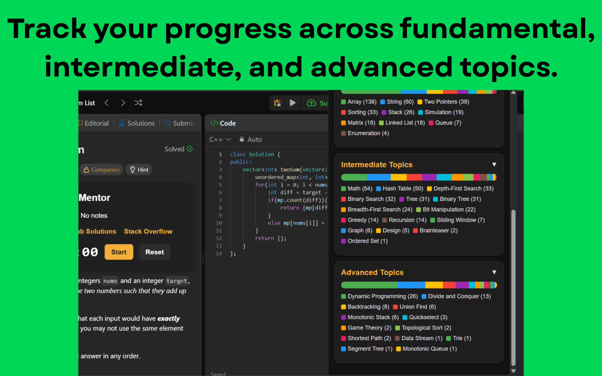
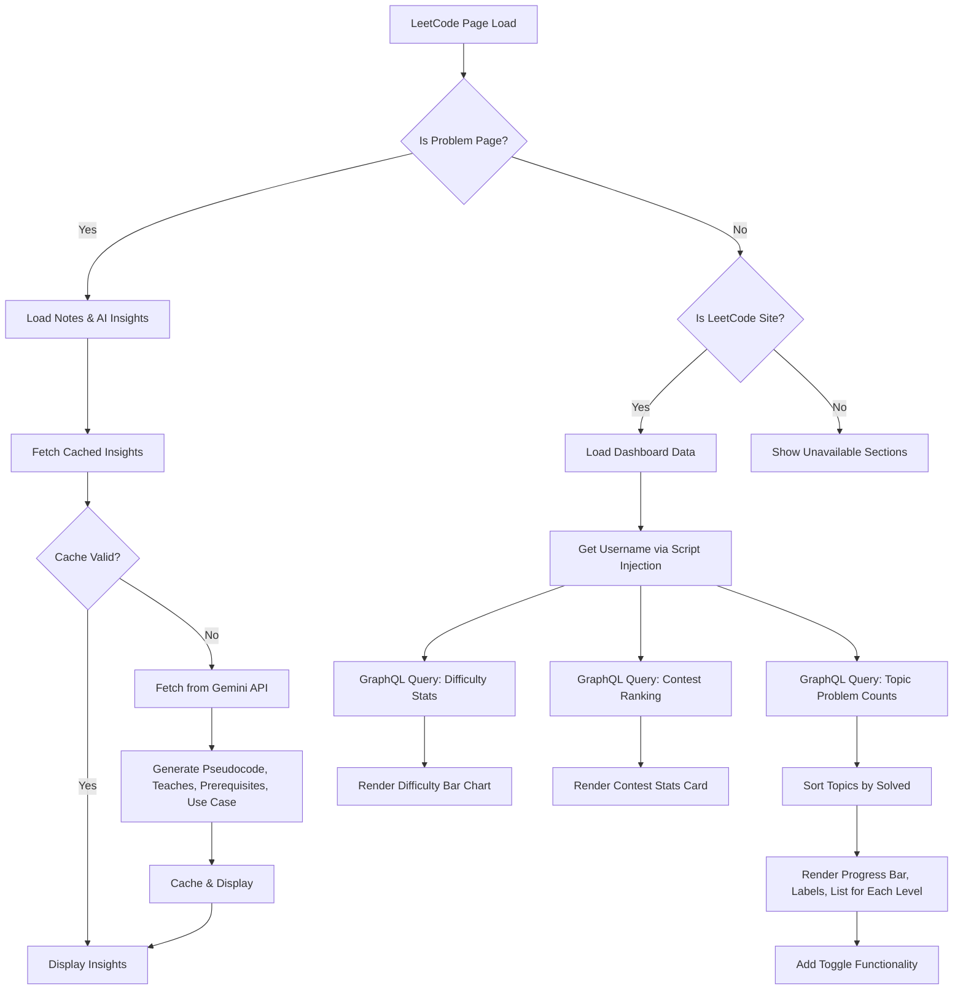
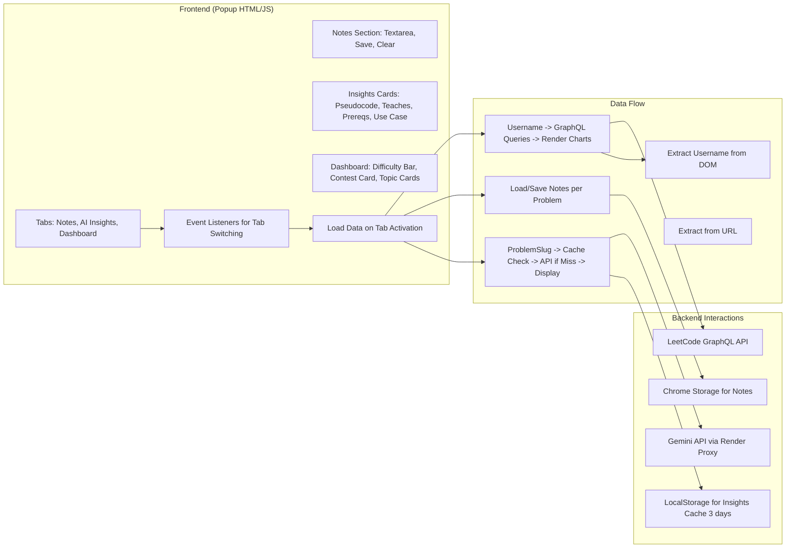
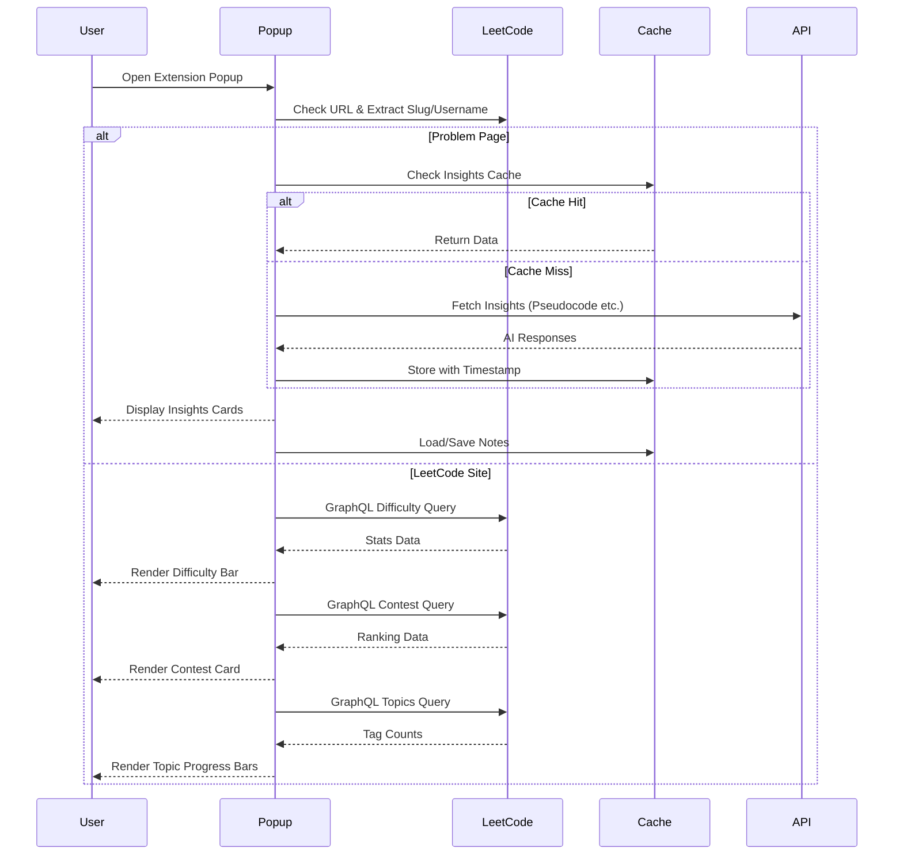

# LeetCode Mentor Chrome Extension

A smart, AI-enhanced Chrome extension that helps you solve, track, and master LeetCode problems — with personalized notes, helpful links, a stopwatch, and Gemini-powered insights

---


[](https://chromewebstore.google.com/detail/leetcode-mentor/naodegdjgghbeppfefdjfpnpjindgfje)


---

## 🌐 Published At

Chrome Web Store → [view on Web Store](https://chromewebstore.google.com/detail/leetcode-mentor/naodegdjgghbeppfefdjfpnpjindgfje)

---


## ✨ Features
- 📝 Custom Notes: Add personal notes for each LeetCode problem directly on the problem page. 
- 💾 Instant Save: Notes are automatically saved using chrome.storage.local and retrieved instantly.  
- ⏱ Stopwatch / Timer: Track problem-solving time with a built-in stopwatch.  
- 🔗 Helpful Links: Add problem-specific references or resources for quick access.
- 🤖 AI-Powered Insights using [Gemini-ask-api](https://github.com/tusharAgarwal2511/Gemini-ask-api) to:
  - Generate pseudocode for the problem.
  - Explain concepts in simple terms.
  - Suggest prerequisites before attempting the problem. 
  - Highlight real-world applications.
- 💡 Personalized Dashboard on Focus Area tab:
  - Difficulty Stats: Visual breakdown of problems solved by difficulty.
  - Contest Stats: Track contest performance, ratings, and percentile.
  - Topic Stats: See problems solved per topic (Fundamental → Intermediate → Advanced) with progress bars and detailed lists.
- 🔄 Smart Cache System: Minimizes redundant API calls by caching insights for 3 days.    
- ✉️ Seamless UI: Fully integrated with LeetCode’s native look and feel.  
- 🗑 Clear All Data: Easily reset all notes, insights, and timers with one click.

---

## 💻 Tech Stack

- [**JavaScript**](https://developer.mozilla.org/en-US/docs/Web/JavaScript) – Core frontend logic and Chrome extension behavior ✨  
- [**HTML/CSS**](https://developer.mozilla.org/en-US/docs/Web/HTML) – Popup/user interface styling ⚙️  
- [**Chrome Manifest V3**](https://developer.chrome.com/docs/extensions/mv3/) – Extension configuration & permissions 📄  
- [**Gemini Ask API (Custom Backend)**](https://github.com/tusharAgarwal2511/Gemini-ask-api) – Your own Node.js/Express microservice that connects to Google’s Gemini 🤖  
- [**Google Gemini API**](https://developers.generativeai.google/) – Generates AI-powered insights and explanations 🧠  

---

## 📸 Screenshots  

| | |
|---|---|
|  |  |
|  |  |
|  | |

---

## 🧩 System Architecture
High-level overview of how the Chrome extension communicates with backend services.

### 1. Flowchart (High-Level Process)
Illustrates the decision-based flow from popup load to rendering, highlighting caching and data fetching logic. Demonstrates performance optimization by caching AI insights for 3 days, reducing API calls.



### 2. Component and Data Flow Diagram
Breaks down frontend components, backend interactions, and pipelines—emphasizing modularity and error handling.



### 3. Sequence Diagram (User Interaction Flow)
Highlights asynchronous interactions and error handling—demonstrating robust UX.



---

## 🚀 Getting Started

### 1. Clone the repo
```bash
git clone https://github.com/tusharAgarwal2511/LeetCode-Mentor.git
cd LeetCode-Mentor
```

### 2 . Load locally into Chrome
• Go to chrome://extensions  
• Enable Developer Mode  
• Click “Load unpacked”  
• Select this project folder

# 3. (Optional) Ping backend API
https://gemini-ask-api.onrender.com


