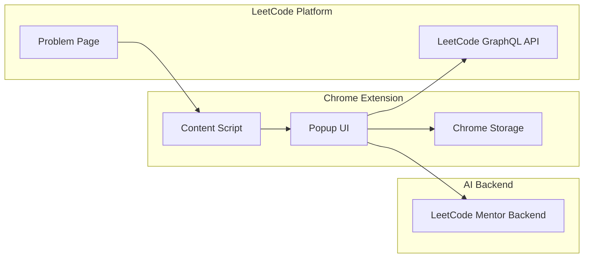
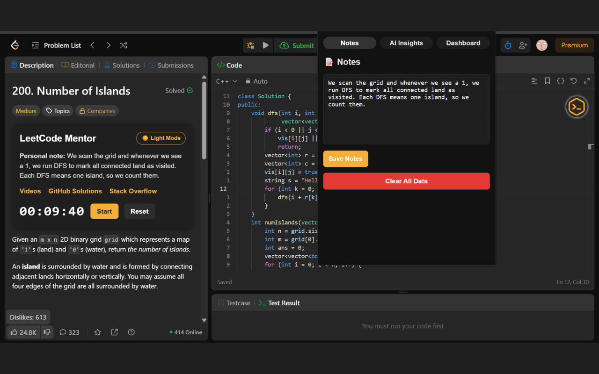
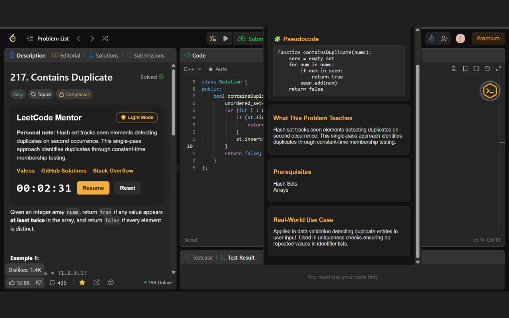
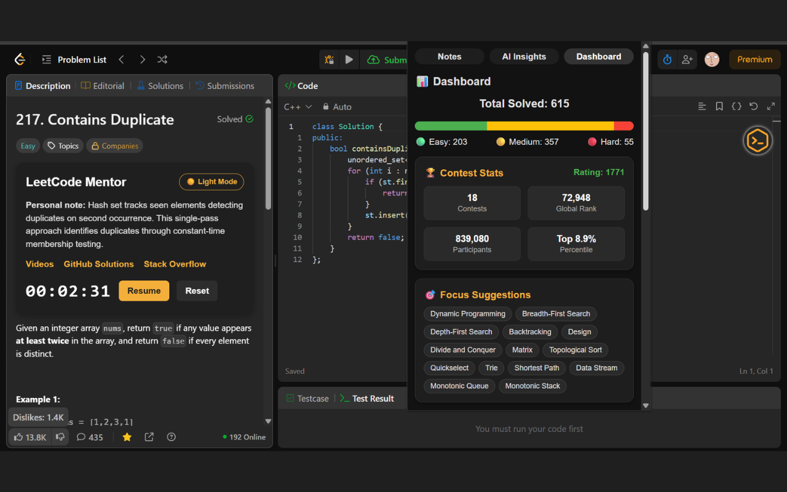
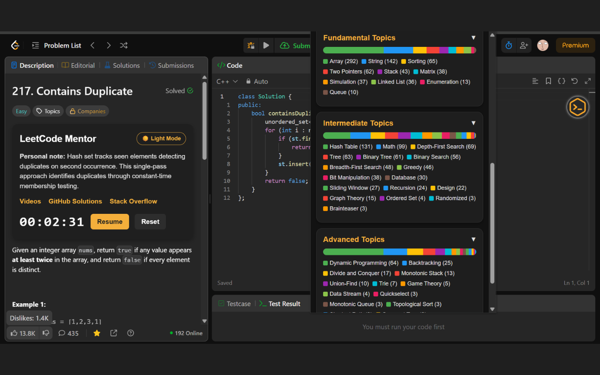

# LeetCode Mentor

A polished Chrome extension that turns LeetCode into a guided interview-preparation workspace. It combines persistent problem notes, AI-generated insights, and a personal progress dashboard so developers can move from problem statement to solution with clarity and context. The project also includes a dedicated backend at [LeetCode Mentor Backend](https://github.com/tusharAgarwal2511/LeetCode-Mentor-Backend) for AI-powered responses.

## 🌐 Published on the Chrome Web Store

[View on Chrome Web Store](https://chromewebstore.google.com/detail/leetcode-mentor/naodegdjgghbeppfefdjfpnpjindgfje)

---


[](https://chromewebstore.google.com/detail/leetcode-mentor/naodegdjgghbeppfefdjfpnpjindgfje)

---

## 🌐 Overview

LeetCode Mentor is designed for developers who want more than just a problem list. It brings structure to practice sessions by surfacing valuable context for each problem: personalized notes, AI-generated explanations, prerequisite guidance, and a dashboard that highlights performance patterns over time.

The experience feels native to LeetCode while giving users a more intentional and productive workflow for interview prep.

---

## ✨ Feature Set

- 📝 Problem-specific notes that are saved locally and available whenever you revisit a question
- 🤖 AI-powered insights for pseudocode, concept explanations, prerequisites, and real-world use cases
- 📊 A dashboard for difficulty trends, contest performance, and topic-wise progress
- ⚡ Fast, lightweight interactions with local caching to reduce repeated API calls
- 🧠 A clean, focused UI that blends into the LeetCode experience without feeling intrusive
- 🗑 Easy reset controls for clearing saved notes and cached insight data

---

## 🤖 AI Features and Backend

The extension uses a dedicated backend service to power its AI-generated responses.

- Backend repository: [LeetCode Mentor Backend](https://github.com/tusharAgarwal2511/LeetCode-Mentor-Backend)

The backend supports:

- 🧩 Pseudocode generation for the active problem
- 🧠 Beginner-friendly explanations of the key concept
- ✅ Prerequisite suggestions before solving
- 🌍 Real-world applications and intuition behind the pattern

---

## 🧰 Tech Stack

- [JavaScript](https://developer.mozilla.org/en-US/docs/Web/JavaScript) – extension logic and UI behavior
- [HTML/CSS](https://developer.mozilla.org/en-US/docs/Web/HTML) – popup structure and styling
- [Chrome Manifest V3](https://developer.chrome.com/docs/extensions/mv3/) – extension configuration and permissions
- [Chrome Storage API](https://developer.chrome.com/docs/extensions/reference/storage/) – local persistence for notes and cached data
- [LeetCode GraphQL endpoints](https://leetcode.com/graphql) – dashboard statistics and user progress data
- [Gemini-powered backend](https://github.com/tusharAgarwal2511/LeetCode-Mentor-Backend) – AI insights and explanation generation

---

## 🧩 System Architecture


```mermaid
flowchart LR
    subgraph Browser[Chrome Extension]
        Popup[Popup UI]
        Content[Content Script]
        Storage[Chrome Storage]
    end

    subgraph LeetCode[LeetCode Platform]
        Problem[Problem Page]
        GraphQL[LeetCode GraphQL API]
    end

    subgraph Backend[AI Backend]
        API[LeetCode Mentor Backend]
    end

    Problem --> Content
    Content --> Popup
    Popup --> Storage
    Popup --> GraphQL
    Popup --> API
```

---

## 📁 Project Structure

- manifest.json – extension metadata, permissions, and entry configuration
- popup.html – popup layout and tabbed interface
- script.js – core logic for notes, insights, dashboard loading, and data fetching
- inject.js – LeetCode page integration logic
- styles.css – extension styling
- images/ – app icons and screenshots
- neetcode_150_data.json – topic and practice data used by the dashboard

---

## 📸 Screenshots

| Screenshot | Preview |
|---|---|
| LSM1 |  |
| LSM2 |  |
| LSM3 |  |
| LSM4 |  |

---

## 🚀 Getting Started

### Prerequisites

- Google Chrome
- A working backend instance for the AI insights API

### Installation

```bash
git clone https://github.com/tusharAgarwal2511/LeetCode-Mentor.git
cd LeetCode-Mentor
```

### Load the extension locally

1. Open chrome://extensions
2. Enable Developer Mode
3. Click Load unpacked
4. Select this project folder
5. Open a LeetCode problem page and launch the extension popup

> The AI-powered insight features rely on the backend repository linked above being available.

---

## 📝 Notes

LeetCode Mentor is built to feel like a smart study companion rather than just a utility tool. It helps users build stronger problem-solving habits, retain concepts more effectively, and prepare for interviews with more confidence.


